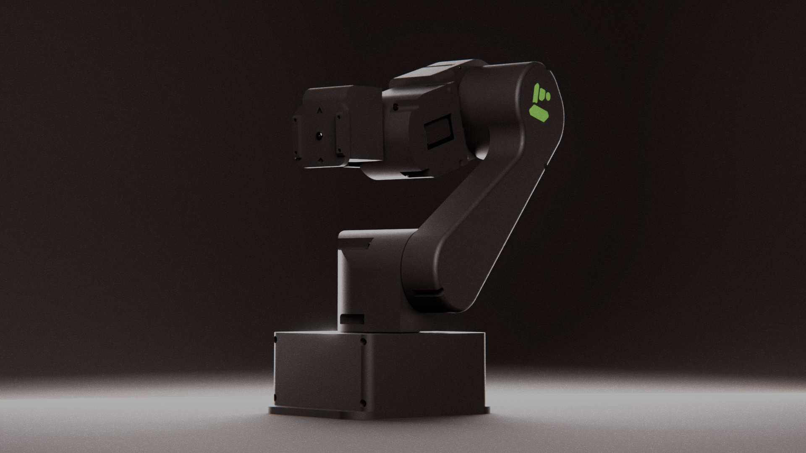

# HumanEd's Morris v2

The MV2 robot has been designed as a low-cost 6-axis serial manipulator that can be easily tailored to use different control systems and end-effectors. The robot follows the standard joint arrangement seen on many industrial 6-DOF manipulators, with a 2R open-chain attached to a rotating base used as the positioning system for a spherical wrist.

MV2 is a project of [HumanEd](https://humaned.eusa.ed.ac.uk/), the Humanoid Robotics Society at the University of Edinburgh.